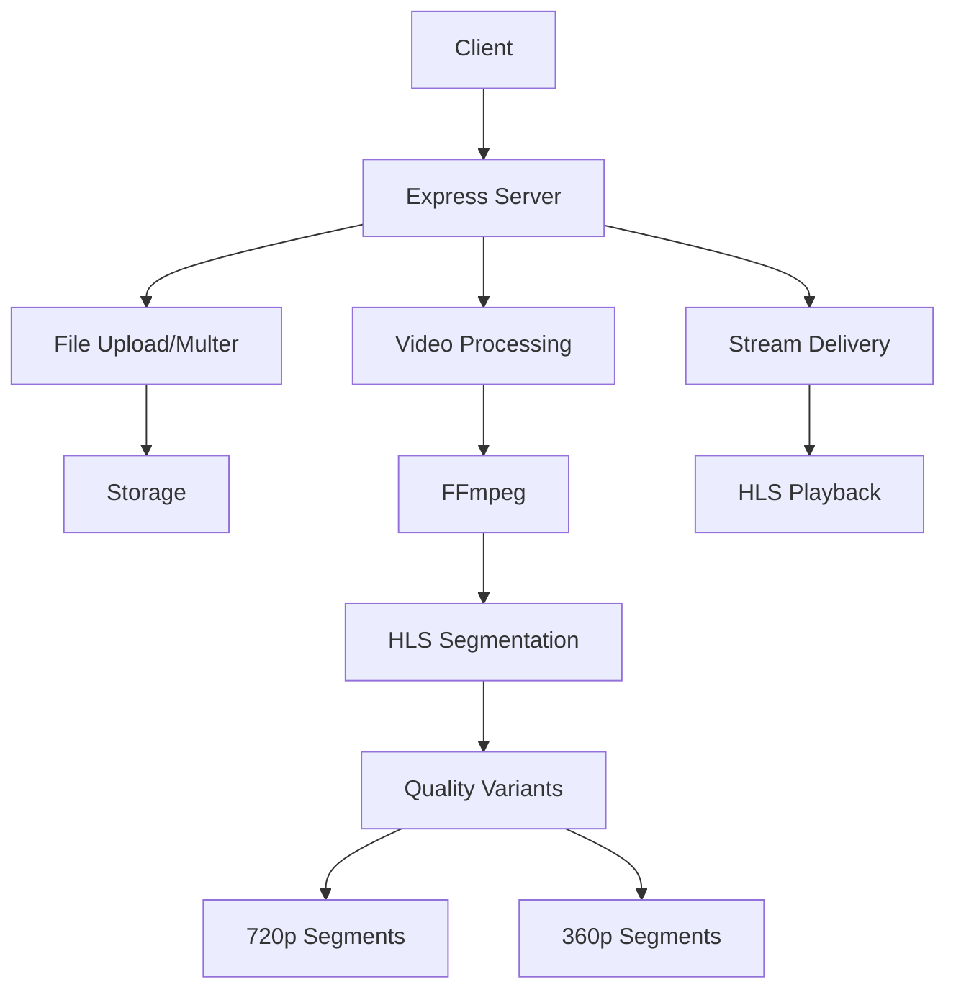
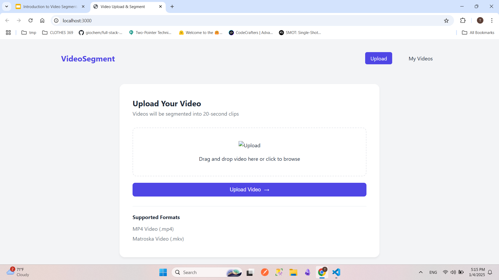
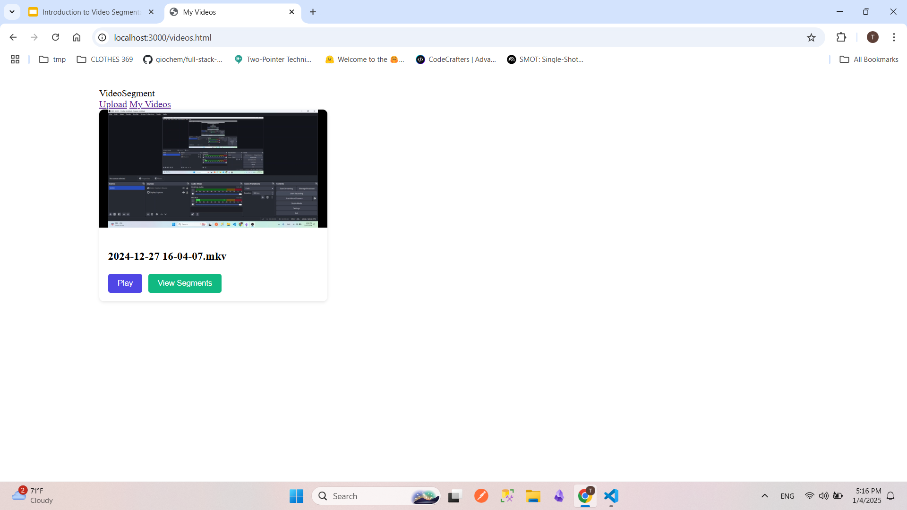
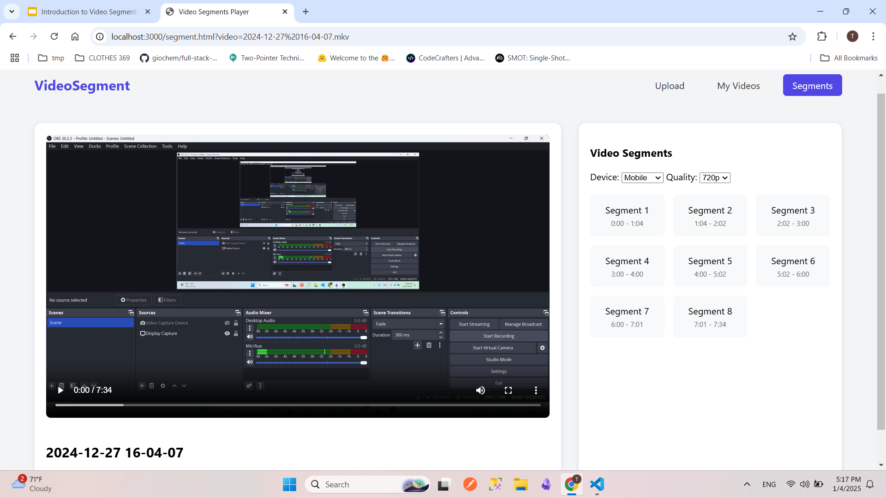
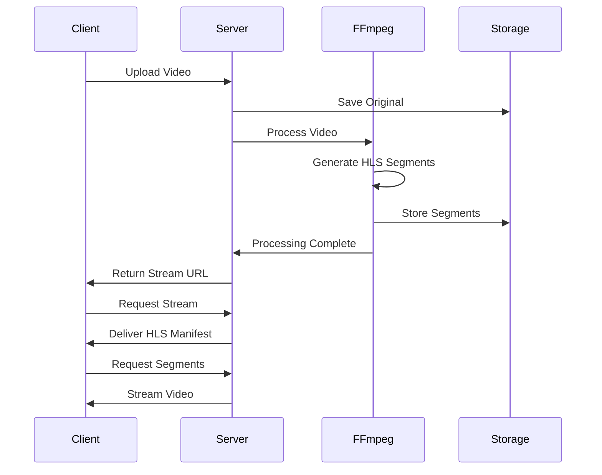
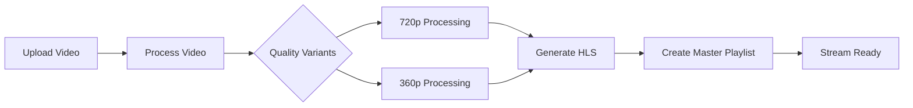

# Video Streaming Service

## Introduction

A high-performance video streaming service that supports adaptive bitrate streaming with device-specific optimizations. The service converts uploaded videos into HLS (HTTP Live Streaming) format, supporting multiple quality levels and device configurations.

## Technical Presentation

For a detailed technical overview of this project, please refer to my comprehensive presentation:
[Introduction to Video Segmentation and Adaptive Bitrate Streaming](./docs/Introduction%20to%20Video%20Segmentation%20and%20Adaptive%20Bitrate%20Streaming.pdf)

## System Architecture



## Usage Examples

### 1. Video Upload Interface


_Video upload interface showing supported formats and upload progress_

### 2. Video Library


_Available videos with streaming options and quality selection_

### 3. Video Segmentation Process


_HLS segmentation process with multiple quality variants_

## Implementation Details

### Core Features

- Multi-device support (desktop/mobile)
- Adaptive bitrate streaming (720p, 360p)
- HLS segmentation with device-specific configurations
- Automatic video quality optimization
- Support for MP4 and MKV formats

### Technical Architecture

```
src/
├── segments/          # HLS segments and playlists
│   ├── video1/
│   │   ├── desktop/
│   │   │   ├── 720p/
│   │   │   └── 360p/
│   │   └── mobile/
│   │       ├── 720p/
│   │       └── 360p/
│   └── video2/
├── uploads/          # Original video files
└── segment.js        # Video processing logic
```

### API Endpoints

- `POST /upload` - Upload video files
- `GET /api/videos` - List all available videos
- `GET /segments/{videoName}/{device}/master.m3u8` - Access HLS streams
- `GET /uploads/{filename}` - Access original videos

### Video Processing Configuration

- Desktop: 1920x1080 max resolution, 120s segments
- Mobile: 1280x720 max resolution, 60s segments
- Quality Levels:
  - 720p (2800kbps)
  - 360p (800kbps)

## Video Processing Flow



## Getting Started

```bash
# Install dependencies
npm install

# Start the server
npm start

# Development mode
npm run dev
```

## API Flow



## Summary

This service provides enterprise-grade video streaming capabilities with device-aware optimizations and adaptive bitrate streaming. It's built using Node.js, Express, and FFmpeg, offering reliable video processing and efficient content delivery through HLS protocol.

## Technologies

- Node.js & Express
- FFmpeg for video processing
- HLS.js for playback
- Multer for file uploads
- fs-extra for enhanced file operations
